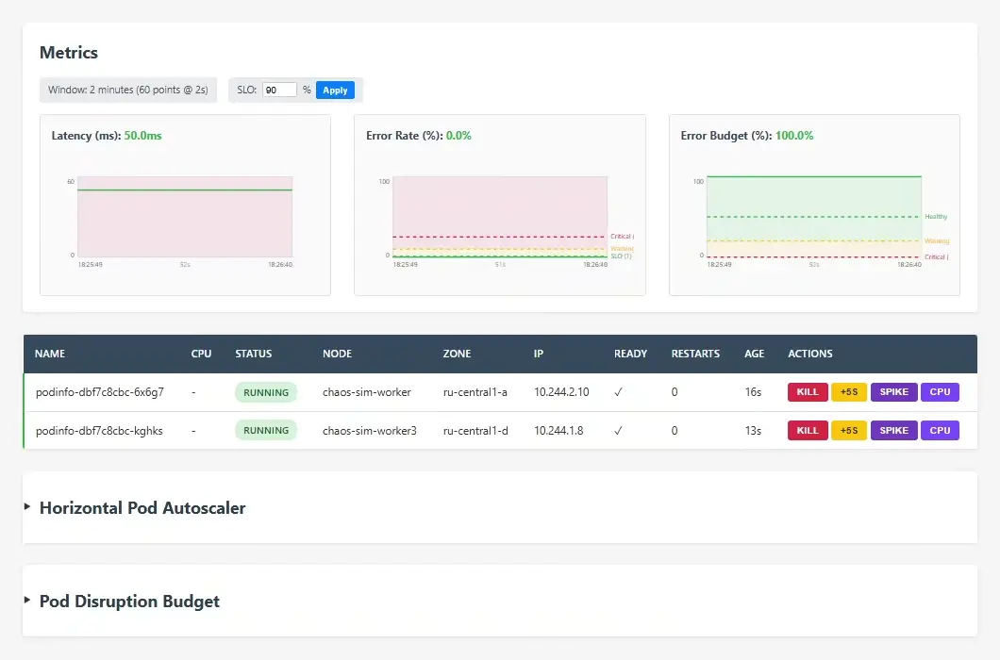
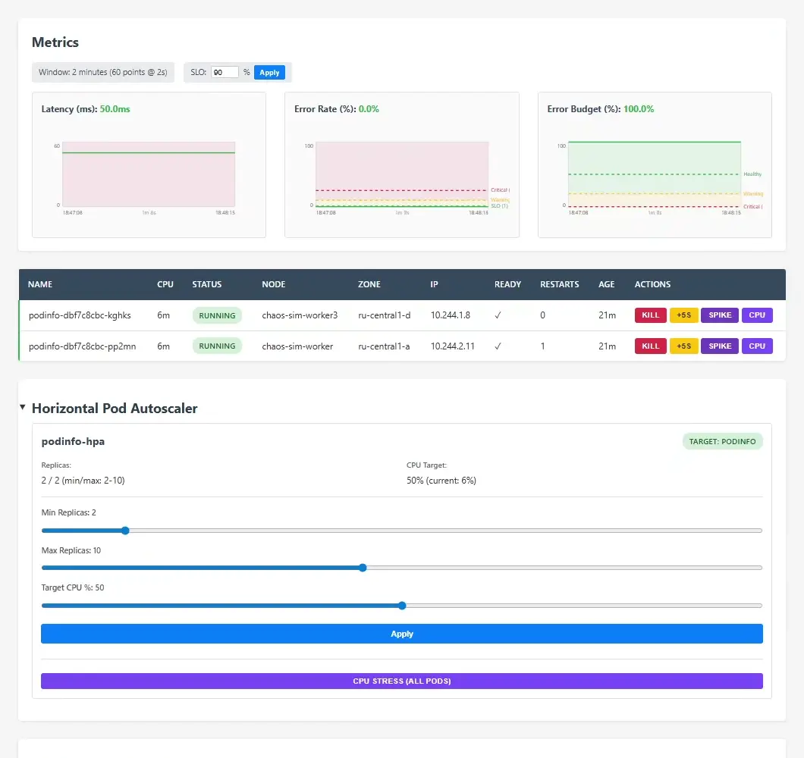
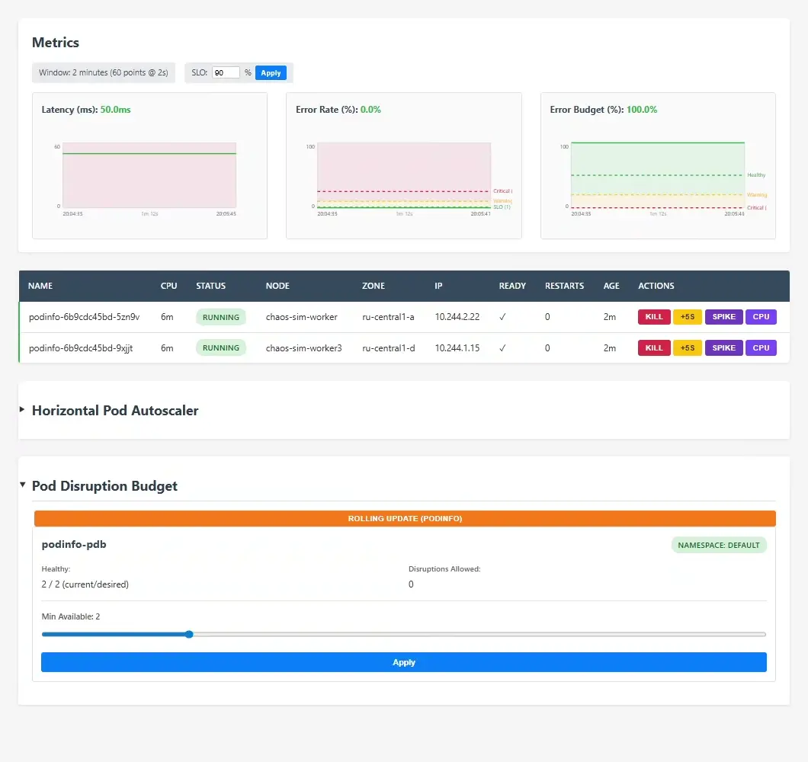

# kube-chaos-sim

A Kubernetes chaos engineering dashboard: click buttons to run real chaos
actions (kill pod, inject latency, memory spike) against a real cluster,
watch the pod grid and HPA/PDB react in real time.



<details>
<summary>More demos</summary>


Min replicas: 2 → 4 → CPU STRESS → replicas: 4 → 10 across 3 zones → auto-downscale


MinAvailable: 2 + Rolling Update

</details>

## Features

- Real chaos actions via client-go (delete pod, patch deployment, kubectl exec)
- Pod grid with real-time status updates (Running, CrashLoopBackOff, Restarting)
- HPA autoscaling with CPU stress testing
- PDB protection during rolling updates
- Synthetic metrics (Latency, Error Rate, Error Budget) with 2-minute rolling history
- SSE-based real-time updates (no WebSocket, no page reload)
- Cross-zone deployment (3 availability zones)

## Stack

- **Cluster:** kind (local, disposable)
- **Backend:** Go + client-go (Informers, in-memory cache)
- **Realtime:** SSE via Datastar (no WebSocket, no JSON API)
- **Frontend:** plain HTML + Datastar `data-*` attributes (no React, no npm)
- **Metrics:** synthetic generator in Go (no Prometheus required for demo)

## Quick start

### Prerequisites

Install tools:
- [kind](https://kind.sigs.k8s.io/docs/user/quick-start/#installation)
- [helm](https://helm.sh/docs/intro/install/)
- [kubectl](https://kubernetes.io/docs/tasks/tools/)

### Step 1: Create cluster and install infrastructure

```bash
# Create kind cluster, install metrics-server, deploy podinfo
./scripts/setup-cluster.sh
```

This script:
- Creates kind cluster with 3 emulated zones (ru-central1-a/b/d) and extraPortMappings (localhost:8080 → NodePort:30080)
- Installs metrics-server with 15s resolution (minimum supported, default 60s)
- Deploys podinfo as target microservice
- Applies accelerated HPA settings (sync-period=5s, downscale-stabilization=20s)

### Step 2: Build and deploy the backend

```bash
# Build Docker image, load into kind, deploy with Helm
./scripts/build-image.sh
```

This script:
- Builds backend Docker image (multi-stage build with Go binary + kubectl)
- Loads image into kind cluster (all nodes)
- Deploys backend with Helm (includes RBAC for client-go operations)
- Waits for deployment to be ready

Dashboard is available at http://localhost:8080 automatically (via kind's `extraPortMappings` + NodePort Service). No `kubectl port-forward` needed.

### Iterative development

After making changes to the backend code, rebuild and redeploy:

```bash
./scripts/build-image.sh
```

This will rebuild the image, load it into kind, and redeploy the backend.

## Project structure

```
cmd/server/       — entrypoint
internal/k8s/     — client-go setup, Informers, in-memory cache
internal/chaos/   — Chaos Controller (kill pod, inject latency, etc.)
internal/metrics/ — synthetic metrics generator
internal/sse/     — SSE broadcaster
web/              — static HTML + Datastar attributes
assets/           — demo screenshots/gifs
helm/             — Helm charts
  kube-chaos-sim/ — backend deployment (ServiceAccount, ClusterRole, Deployment, Service)
  podinfo-values.yaml — target microservice values
  values-cloud.yaml — cloud-specific overrides (LoadBalancer, YCR image)
terraform/        — Yandex Cloud infrastructure (VPC, k8s, registry)
  bootstrap/      — S3 bucket for Terraform state (one-time setup)
scripts/          — setup and build scripts
.github/workflows/ — CI/CD (deploy.yml, destroy.yml)
Dockerfile        — multi-stage build for backend
kind-config.yaml  — kind cluster config (zones, port mappings, HPA acceleration)
```

## Cloud deployment (Yandex Cloud)

The project supports deployment to Yandex Cloud for testing cross-zone behavior and real managed Kubernetes.

### GitHub Secrets

| Secret | Purpose |
|--------|---------|
| `YC_KEY_JSON` | IAM key for CI service account (Terraform + YCR auth) |
| `YC_FOLDER_ID` | Yandex Cloud folder ID |
| `AWS_ACCESS_KEY_ID` | Static key for S3 backend (Terraform state) |
| `AWS_SECRET_ACCESS_KEY` | Secret part of static key |
| `TF_STATE_BUCKET` | S3 bucket name for Terraform state |

### Service account permissions

**CI Service Account** (`kube-chaos-sim-ci`):
- Role: `resource-manager.admin` on folder level
- Used by: GitHub Actions (Terraform, Helm, YCR push)
- Created manually (not by Terraform) — Terraform cannot assign IAM roles without already having IAM admin permissions

**Node Service Account** (`kube-chaos-sim-node`):
- Role: `container-registry.images.puller`
- Used by: Kubernetes nodes (pull images from YCR)

### Cloud architecture

- **3 nodes** (1 per zone: ru-central1-a/b/d) — demonstrates cross-zone scheduling
- **Budget-optimized**: preemptible VMs, 20% CPU guarantee, 2GB RAM, 30GB disk
- **Platform**: Intel Cascade Lake (standard-v2) — cheaper than Ice Lake
- **LoadBalancer** for public access (no auth — cluster is short-lived)
- **Remote Terraform state**: S3 backend via Yandex Object Storage

See `.clinerules/ARCHITECTURE.md` for detailed setup instructions (bootstrap, CI/CD workflows, security groups).
